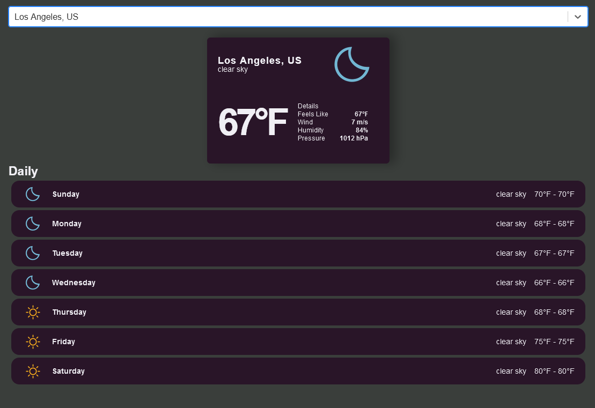

# React Weather Application
[](https://opensource.org/licenses/MIT)

## Purpose
A basic react weather application for keeping track of the weather

## Built With
- [React](https://reactjs.org/)



## Contents

---
- [Purpose](#purpose)
- [Installation](#installation)
- [Usage](#usage)
- [Contributing](#contributing)
- [Contact](#contact)


## Installation

```
git clone https://github.com/KKWChao/ReactWeatherApp.git

npm init -y

npm install

```

## Contact
- KKWChao: https://github.com/KKWChao

